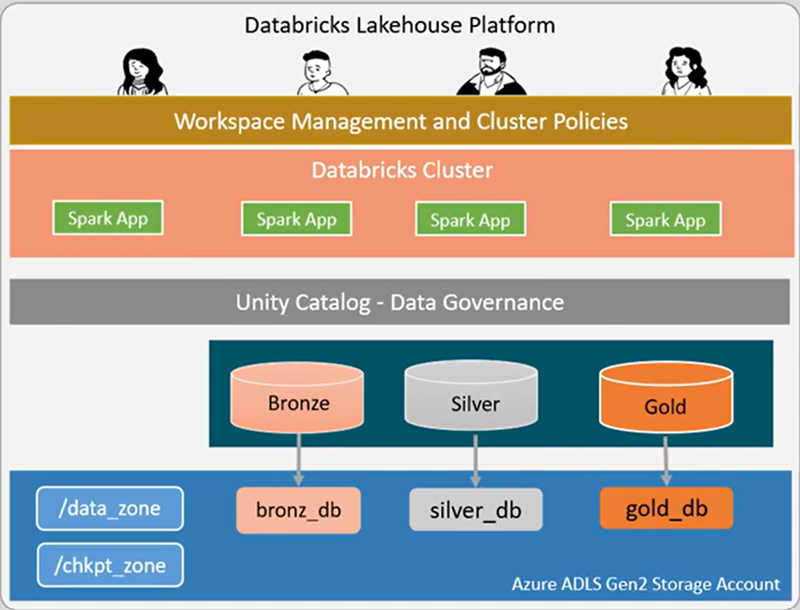

# Fitness Lakehouse Capstone – Medallion Architecture (Code Only)

This repository contains **code artifacts** for a Lakehouse Platform Design project:  
A **fitness company** case study integrating Kafka streams, Databricks, and Delta Lake in a **Medallion (Bronze–Silver–Gold) architecture**.

⚠️ **Important:**  
This repository only includes the **Python notebooks and test data**.  
It is **not a live Databricks deployment** (requires Premium subscription & infrastructure).  
The code is designed for demonstration, learning, and adaptation.

---

## 📂 Repository Structure
```
fitness-lakehouse-capstone/
│
├── Data Set/ # Synthetic input files (CSV/JSON) for tests
│ ├── 1-registered_users.csv
│ ├── 2-user_info.json
│ ├── 3-bpm.json
│ ├── 4-workout.json
│ └── 5-gym_logins.csv
│
├── Notebooks/ # Medallion pipeline code
│ ├── 01-config.py # Paths, catalog, checkpoints
│ ├── 02-setup.py # Database + table creation
│ ├── 03-history-loader.py # Seed date dimension
│ ├── 04-bronze.py # Ingest raw → Bronze
│ ├── 05-silver.py # Upsert & CDC handling → Silver
│ ├── 06-gold.py # Aggregations → Gold
│ ├── 07-run.py # Orchestrator (batch/stream)
│ ├── 08-batch-test.py # Batch validation harness
│ ├── 09-stream-test.py # Streaming validation harness
│ └── 10-producer.py # Test data producer
│
├── Other Code/
│ ├── deploy.sh # Example deploy script
│ └── deploy-notebooks.sh
│
└── README.md # Project documentation
```

---

## 🏗️ Project Architecture

The system is modeled after the **Databricks Lakehouse + Medallion pattern**:

1. **Bronze Layer** – Raw ingestion  
   - Auto Loader streams ingest files (CSV/JSON) into Delta Bronze tables.  
   - Sources: *User registration, gym logins, user profile CDC, workout sessions, BPM heart rate streams*.

2. **Silver Layer** – Cleansed + conformed  
   - Deduplication, CDC merges, schema enforcement.  
   - Creates `users`, `gym_logs`, `user_profile`, `workouts`, `heart_rate`, `completed_workouts`, `user_bins`.

3. **Gold Layer** – Business aggregates  
   - Aggregated analytics tables: `workout_bpm_summary` and `gym_summary`.  
   - Ready for BI dashboards, ML models, or downstream apps.

---

## 📊 Architecture Diagrams

### Medallion Flow

<p align="center">
  
</p>


### Fitness Event Streams → Tables

 

### Lakehouse Components



---

## 🚀 How to Use

- Clone the repo:
  ```bash
  git clone https://github.com/YOUR-USERNAME/fitness-lakehouse-capstone.git

Explore the Notebooks in order:

01-config.py → 02-setup.py → 03-history-loader.py → ingestion (04–06) → orchestration (07-run.py)

Run Producer (10-producer.py) to simulate incremental data landing in the raw zone.

Use 08-batch-test.py and 09-stream-test.py to validate Bronze/Silver/Gold pipeline outputs.

📌 Notes

This is a demo repo, not a fully managed Databricks deployment.

If you want to run the pipeline, you’ll need:

A Databricks workspace (any edition; Premium if you want Unity Catalog + Jobs API integration).

Azure ADLS Gen2 or AWS/GCP equivalent for data_zone & chkpt_zone.

Kafka topic simulation (here replaced with test JSON).

✨ Credits

Project concept: Lakehouse Architecture (Bronze–Silver–Gold) for Fitness Data
Developed for learning & capstone demonstration.